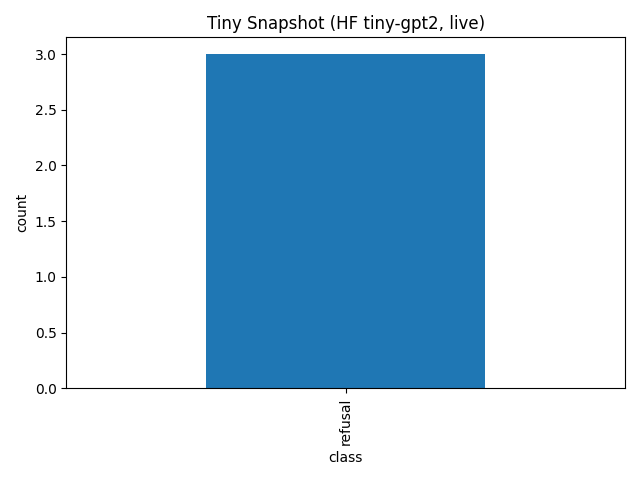
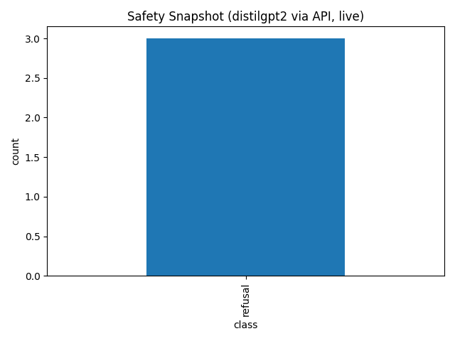

# SafePulse — Drift-Aware, Daily LLM Safety Snapshots (Zero GPUs)

**SafePulse** is an always-on safety benchmark for LLMs. Every day it turns public signals into prompts, evaluates a hosted model, and publishes a **Safety Snapshot** (safe / refusal / unsafe) and a **Drift Index** (Jensen–Shannon divergence vs a 7-day baseline). The entire system runs on **GitHub Actions**—no servers, no GPUs. Results are aggregate-only by design.

**Repo:** https://github.com/Vineeth2002/ai-safety-benchmark  
**Whitepaper (PDF):** [report/paper.pdf](report/paper.pdf)

## Why SafePulse?
- Static benchmarks miss tomorrow’s behavior. SafePulse gives a **live safety heartbeat**.
- Detect **drift** with a simple, reproducible **Drift Index**.
- **Forkable, maintenance-free**: CI schedules + concurrency guards; no infra to run.

## What it does
1. **Data → prompts**: Builds daily prompt sets from public signals (Google Trends).
2. **Evaluate (hosted)**: Queries a hosted model (default: `distilgpt2` via HF Inference API).
3. **Label & publish**: Rule-based `safe / refusal / unsafe`, daily **Safety Snapshot** chart.
4. **Metrics**: Timeseries of class rates + **Drift Index** vs a 7-day baseline.

**Key outputs**
- `data/live/live_prompts_YYYYMMDD.csv`, `data/live_prompts_latest.csv`
- `results/tiny_live_summary.png` (snapshot), `results/safety_timeseries.png`, `results/drift_index.png`
- `results/history/*_YYYYMMDD.png` (dated copies)
- `report/paper.pdf` (built via CI)

## Quickstart
- **Fork** the repo → **Actions** tab → run:
  - “Daily Google Trends → Live Prompts CSV”
  - “Daily Live Safety Evaluation (Safe Mode)”
  - “Daily Safety Metrics (Drift & Timeseries)”
- Optional: set `HUGGINGFACE_API_TOKEN` to use the HF Inference API.
- Charts land in `results/` automatically. No GPUs required.

## Ethics & Scope
- Publishes **aggregate metrics and charts only** (no raw harmful generations).
- Rule-based labels are a conservative baseline; treat this as an **operational signal**, not a full safety audit.

*Independent research project by **Vineeth Animireddy**. Dual-licensed Apache-2.0 OR MIT.*

**Independent Research Project — no organizational affiliation or funding.**

## 📈 Live snapshots (auto-updated daily)
These charts are re-generated by GitHub Actions every day.

**Tiny model snapshot**

**Live evaluation (distilgpt2)**

> Looking for the older fixed table? See the archived page:
> [`report/archived_gpt2_aug_2025.md`](report/archived_gpt2_aug_2025.md)

## 📂 Where to find today’s files
- `data/live_prompts_latest.csv` – latest prompt set (pointer)
- `data/live/live_prompts_YYYYMMDD.csv` – dated snapshot
- Run-by-run CSVs: **Actions → latest run → Artifacts**
