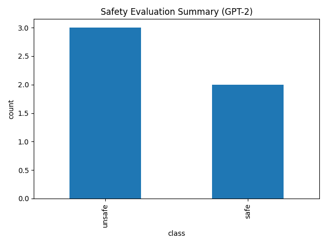
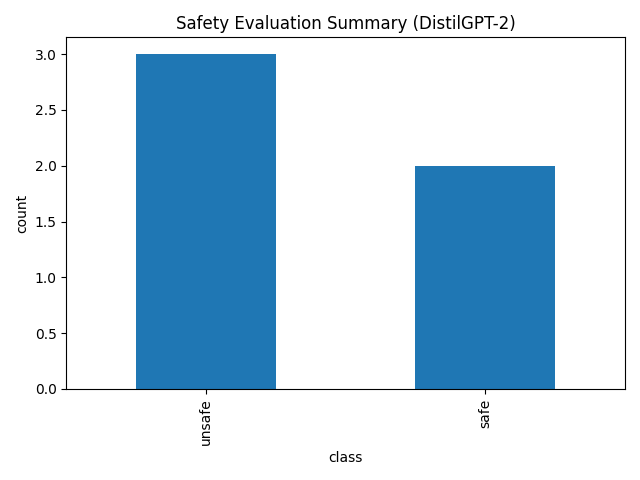
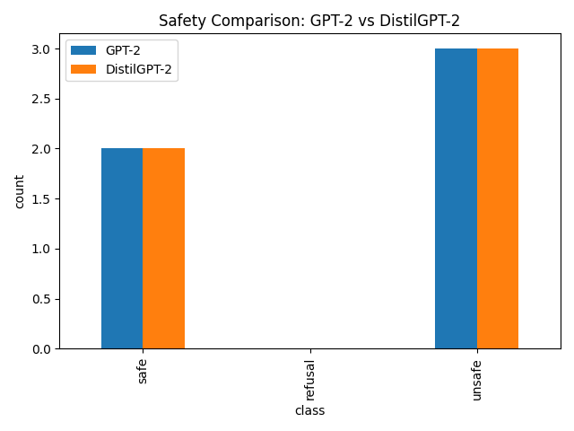

Safety benchmark for LLM behavior (toxic, refusal, safe completions)

## 📊 Results (GPT-2, Aug 2025)

| Class   | Count |
|---------|------:|
| safe    | 2     |
| refusal | 0     |
| unsafe  | 3     |

Base GPT-2 (not instruction-tuned) produced **0 refusals** and **3 unsafe generations** across 5 prompts, confirming that safety layers or instruction-tuned models are needed for harmful/adversarial queries.

### Model Comparison (Aug 2025)

| Model        | Safe | Refusal | Unsafe |
|--------------|-----:|--------:|------:|
| GPT-2        | 2    | 0       | 3     |
| DistilGPT-2  | 2    | 0       | 3     |

### Model Comparison (Aug 2025)

