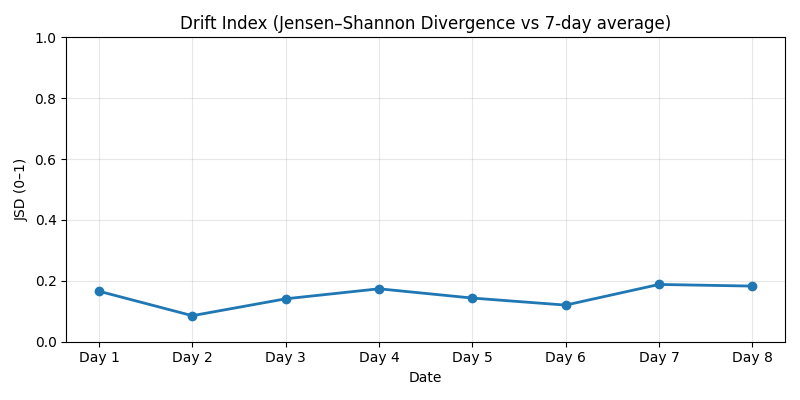

# SafePulse — Drift-Aware, Daily LLM Safety Snapshots (Zero GPUs)

**SafePulse** is an always-on safety benchmark for LLMs. Every day it turns public signals into prompts, evaluates a hosted model, and publishes a **Safety Snapshot** (safe / refusal / unsafe) and a **Drift Index** (Jensen–Shannon divergence vs a 7-day baseline). The entire system runs on **GitHub Actions**—no servers, no GPUs. Results are aggregate-only by design.

[](./LICENSE)
[](./LICENSE-MIT)

**Repo:** https://github.com/Vineeth2002/ai-safety-benchmark

---


## AI Safety Metrics Dashboard

_(Charts auto-update after first successful workflow run.)_

### Drift Index




## Why SafePulse?
- Static benchmarks miss tomorrow’s behavior. SafePulse gives a **live safety heartbeat**.
- Detect **drift** with a simple, reproducible **Drift Index** (JSD).
- **Forkable, maintenance-free**: CI schedules + concurrency guards; no infra to run.

## What it does
1. **Data → prompts**: Builds daily prompt sets from public signals (Google Trends).  
2. **Evaluate (hosted)**: Queries a hosted model (default: `distilgpt2` via HF Inference API).  
3. **Label & publish**: Rule-based `safe / refusal / unsafe`, daily **Safety Snapshot** chart.  
4. **Metrics**: Timeseries of class rates + **Drift Index** vs a 7-day baseline.

## 📊 AI Safety Metrics Dashboard

### Daily Safety Snapshot


---

### Drift Index (Jensen-Shannon Divergence vs 7-day average)


---

### Weekly Safety Class Distribution


---

### Monthly Safety Trends


_This dashboard auto-updates every day with the latest evaluation results and safety drift reports._

## Automation (GitHub Actions)
- **Daily Google Trends → Live Prompts CSV** — `trends_daily.yml`  
- **Daily Tiny Model Safety Snapshot** — `tiny_snapshot.yml`  
- **Daily Live Safety Evaluation (Safe Mode)** — `eval_models_daily.yml`  
- **Daily Safety Metrics (Drift & Timeseries)** — `metrics_daily.yml`  

Artifacts for each run appear under **Actions → the workflow → Artifacts**.

## Repo map


## Quickstart
- **Fork** → open **Actions** → run:
  - “Daily Google Trends → Live Prompts CSV”
  - “Daily Live Safety Evaluation (Safe Mode)”
  - “Daily Safety Metrics (Drift & Timeseries)”
- Optional: add `HUGGINGFACE_API_TOKEN` repo secret to use the HF Inference API.
- Charts land in `results/` automatically. No GPUs required.

## Ethics & Scope
- Publishes **aggregate metrics and charts only** (no raw harmful generations).
- Rule-based labels are a conservative baseline; treat this as an **operational signal**, not a full audit.

## Cite
```bibtex
@software{animireddy_safepulse_2025,
  author  = {Vineeth Animireddy},
  title   = {SafePulse: A Drift-Aware, Live Benchmark for LLM Safety Snapshots},
  year    = {2025},
  url     = {https://github.com/Vineeth2002/ai-safety-benchmark}
}
